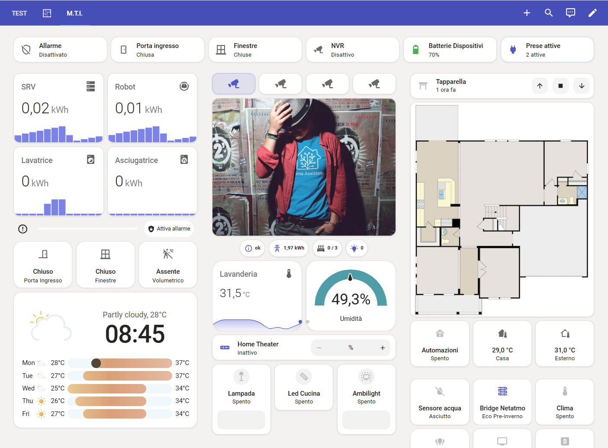

[README.md](https://github.com/user-attachments/files/29460907/README.md)
# 🟣 Microsoft Teams Theme for Home Assistant

A clean, modern Home Assistant theme **inspired by the Microsoft Teams interface** — featuring a bold indigo/violet palette.

> ⚠️ This project is not affiliated with, endorsed by, or associated with Microsoft Corporation or Microsoft Teams in any way. All trademarks belong to their respective owners.

---

## 📸 Preview



---

## 🎨 Color Palette

| Role | Color | Hex |
|------|-------|-----|
| Primary | Indigo | `#5059C9` |
| Accent | Soft Violet | `#7B83EB` |
| Header | Deep Indigo | `#464EB8` |
| Background | Off-White | `#F3F2F1` |
| Error | Red | `#C4314B` |
| Success | Green | `#107C10` |

---

## 📦 Installation

### Via HACS (recommended)

1. Open **HACS** in Home Assistant
2. Go to **Frontend**
3. Click the ⋮ menu → **Custom repositories**
4. Add `https://github.com/luigi-regolo/ha-microsoft-teams-theme` and select category **Theme**
5. Install **Microsoft Teams Theme**
6. Restart Home Assistant

### Manual installation

1. Copy `themes/microsoft_teams.yaml` into your `config/themes/` folder
2. In `configuration.yaml`, make sure you have:
   ```yaml
   frontend:
     themes: !include_dir_merge_named themes
   ```
3. Restart Home Assistant

---

## 🌗 Available Themes

| Theme name | Description |
|------------|-------------|
| `Microsoft Teams` | Light mode |

---

## ⚙️ Activation

**Via UI:** Profile → Theme → select *Microsoft Teams*

**Via automation / service call:**
```yaml
service: frontend.set_theme
data:
  name: Microsoft Teams
```

---

## 📄 License

MIT License — free to use, modify and share.

---

*This theme is inspired by the Microsoft Teams UI. Not affiliated with Microsoft Corporation.*
